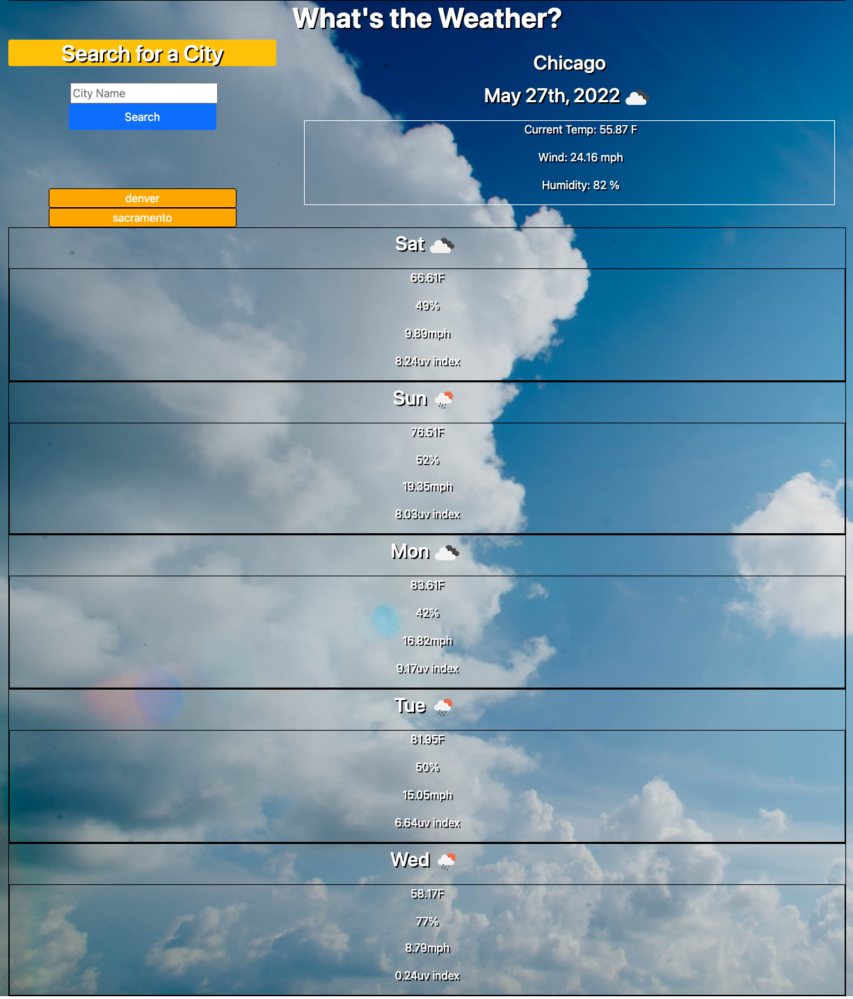
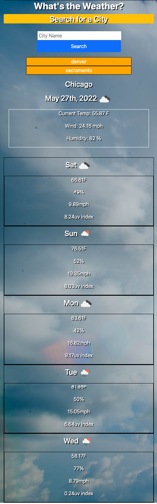

#  What's The Weather?
## Server-Side APIs: Weather Dashboard

## Description and Requirements:

To start using third-party APIs since it allows developers to access data and using it in the context of their own. The app builds a weather dashboard that runs in the browser and features dynamically updated HTML and CSS.

Using the [OpenWeather One Call API](https://openweathermap.org/api/one-call-api) to retrieve weather data for cities, the app uses `localStorage` to store any persistent data and renders it on the screen. 

## User Story

```
AS A traveler
I WANT to see the weather outlook for multiple cities
SO THAT I can plan a trip accordingly
```

## Acceptance Criteria

```
GIVEN a weather dashboard with form inputs
WHEN I search for a city
THEN I am presented with current and future conditions for that city and that city is added to the search history
WHEN I view current weather conditions for that city
THEN I am presented with the city name, the date, an icon representation of weather conditions, the temperature, the humidity, the wind speed, and the UV index
WHEN I view the UV index
THEN I am presented with a color that indicates whether the conditions are favorable, moderate, or severe
WHEN I view future weather conditions for that city
THEN I am presented with a 5-day forecast that displays the date, an icon representation of weather conditions, the temperature, the wind speed, and the humidity
WHEN I click on a city in the search history
THEN I am again presented with current and future conditions for that city
```

## Mock-Up

The following image shows the web application's appearance:





### Deployment: 
[App deployed through Github](https://amccorkl.github.io/Whats_the_Weather/)

